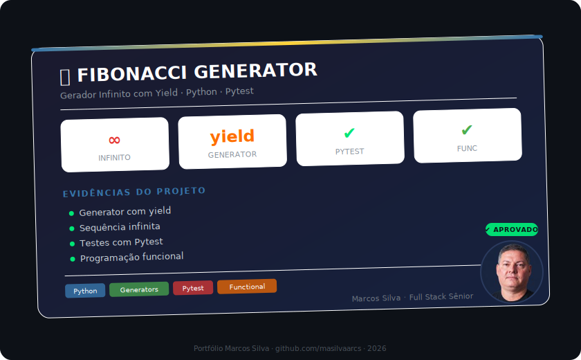

# Fibonacci Generator - Python

Gerador da sequência de Fibonacci usando **Python generators** (`yield`).

## Conceito

A função geradora `fibonacci_generator()` usa `yield` para produzir valores infinitamente sem perder o estado entre chamadas.

## Stack

- Python 3.x
- Pytest

## Como executar

```bash
python fibonacci.py
```

## Testes

```bash
pip install -r requirements.txt
pytest
```

## Saída

```
0 1 1 2 3 5 8 13 21 34 55 89 144 233 377 ...
```

## Autor

**Marcos Silva** — [LinkedIn](https://www.linkedin.com/in/marcosprogramador/)

## 📸 Evidências

<p align="center">
  
</p>

